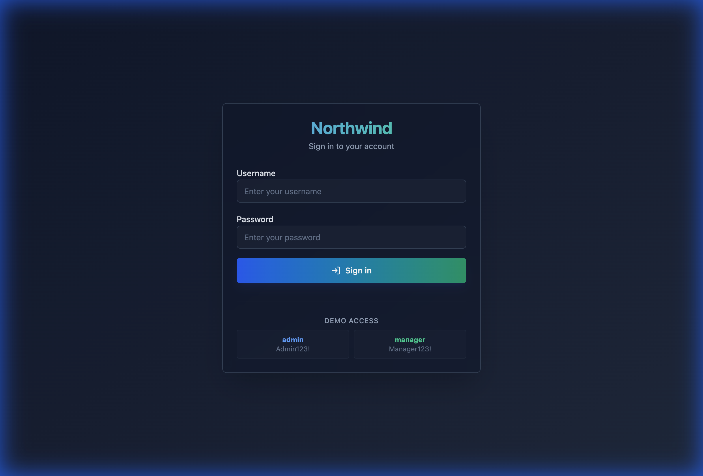
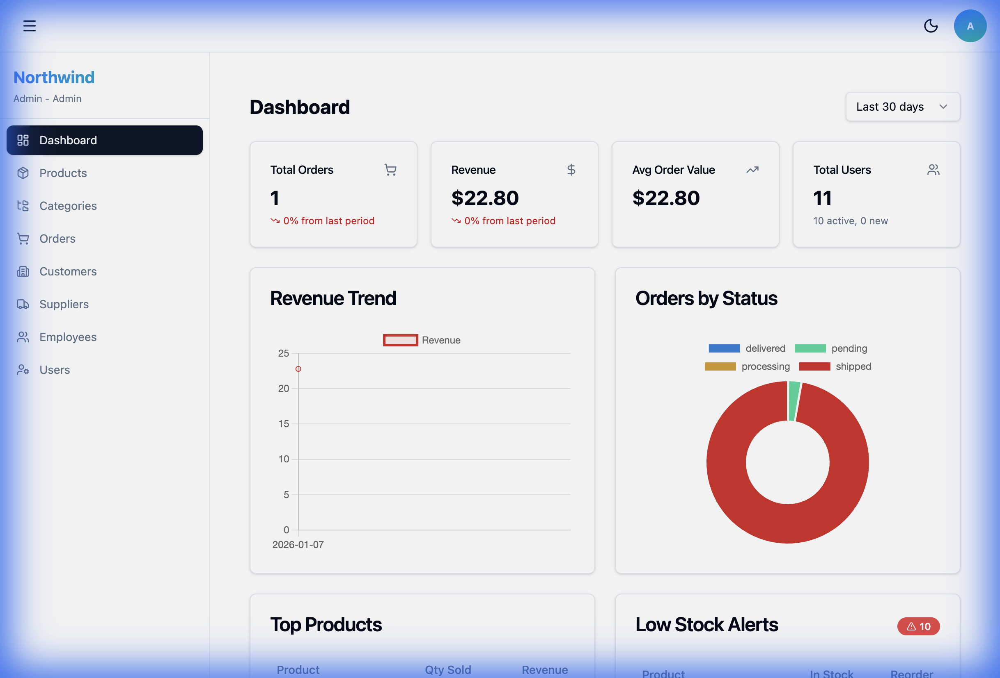
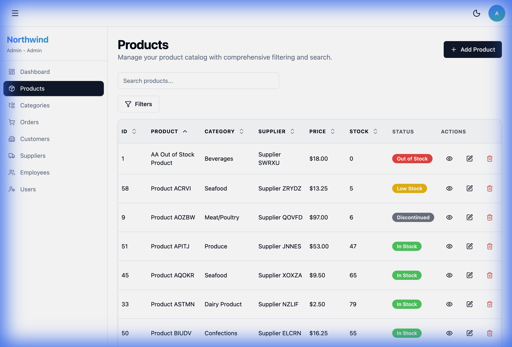
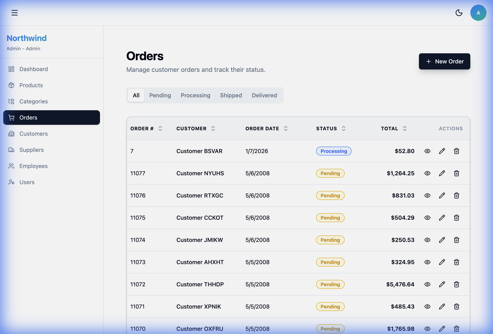

# Northwind Web Application

A modern, full-stack web application based on the classic Northwind database, built with FastAPI, React (Vite), TypeScript, and PostgreSQL.

## Overview

The Northwind Web Application is a comprehensive business management system that demonstrates modern web development practices. Built with a focus on user experience and developer productivity, it provides a complete solution for managing products, orders, customers, employees, and suppliers.

### Key Highlights

**Modern UI/UX**
- Clean, responsive design with Tailwind CSS
- Role-based dashboards with real-time analytics
- Intuitive navigation and data management

**Secure Authentication**
- JWT-based authentication with role-based access control
- Three user roles: Admin, Manager, and Employee
- Secure session management

**Rich Data Visualization**
- Interactive charts and analytics
- Advanced filtering and search capabilities
- Comprehensive CRUD operations

### Application Screenshots

#### Login Page

*Secure authentication with email and password*

#### Dashboard

*Role-specific analytics with sales trends, top products, and key metrics*

#### Products Management

*Comprehensive product catalog with search, filter, and inventory management*

#### Orders Management

*Order tracking and management with status workflow and detailed order information*

## Table of Contents

- [Features](#features)
- [Architecture](#architecture)
- [Prerequisites](#prerequisites)
- [Quick Start](#quick-start)
- [Development](#development)
- [Production Deployment](#production-deployment)
- [Testing](#testing)
- [API Documentation](#api-documentation)
- [Contributing](#contributing)

## Features

### Authentication & Authorization
- JWT-based authentication
- Role-based access control (Admin, Manager, Employee)
- Secure password hashing with bcrypt

### Business Modules
- **Categories**: Manage product categories
- **Suppliers**: Supplier information and management
- **Products**: Product catalog with search, filter, and pagination
- **Customers**: Customer relationship management
- **Employees**: Employee directory and management
- **Orders**: Order processing and tracking with status workflow
- **Dashboard**: Role-specific analytics and charts

### Technical Features
- RESTful API with FastAPI
- React SPA with TypeScript
- Responsive UI with Tailwind CSS
- Real-time form validation
- Comprehensive error handling
- E2E testing with Playwright
- Component documentation with Storybook
- 80%+ backend test coverage

## Architecture

```
┌─────────────────┐      ┌─────────────────┐      ┌─────────────────┐
│                 │      │                 │      │                 │
│  React Frontend │─────▶│  FastAPI Backend│─────▶│   PostgreSQL    │
│   (Vite + TS)   │      │   (Python 3.11) │      │   Database      │
│                 │      │                 │      │                 │
└─────────────────┘      └─────────────────┘      └─────────────────┘
```

### Tech Stack

**Frontend:**
- React 18 with TypeScript
- Vite for build tooling
- Tailwind CSS for styling
- Zustand for state management
- React Hook Form for forms
- Recharts for data visualization
- Playwright for E2E testing
- Storybook for component documentation

**Backend:**
- FastAPI (Python 3.11)
- SQLAlchemy ORM
- Alembic for migrations
- Pydantic for validation
- JWT authentication
- Pytest for testing

**Infrastructure:**
- Docker & Docker Compose
- PostgreSQL 15
- Nginx (production)
- Gunicorn (production)

## Prerequisites

- **Docker** and **Docker Compose** (recommended)
- **Node.js 20+** (for local frontend development)
- **Python 3.11+** (for local backend development)
- **Git**

## Quick Start

### Using Docker (Recommended)

1. **Clone the repository**
   ```bash
   git clone <repository-url>
   cd northwind-test
   ```

2. **Configure environment**
   ```bash
   cp .env.example .env
   # Edit .env if needed
   ```

3. **Start the application**
   ```bash
   docker-compose up -d
   ```

4. **Access the application**
   - Frontend: http://localhost:5173
   - Backend API: http://localhost:8000
   - API Docs: http://localhost:8000/docs
   - Database: localhost:5432

5. **Default credentials**
   ```
   Admin: admin@northwind.com / Admin123!
   Manager: manager@northwind.com / Manager123!
   Employee: employee@northwind.com / Employee123!
   ```

### Development Scripts

For convenience, use the development management script:

```bash
# Start all services (backend + frontend)
./scripts/local-dev.sh start

# Stop all services
./scripts/local-dev.sh stop

# Check service status
./scripts/local-dev.sh status

# Restart all services
./scripts/local-dev.sh restart
```

See [scripts/README.md](scripts/README.md) for more options including individual service control.

## Development

### Project Structure

```
northwind-test/
├── backend/
│   ├── app/
│   │   ├── api/          # API endpoints
│   │   ├── core/         # Core config & security
│   │   ├── models/       # SQLAlchemy models
│   │   ├── schemas/      # Pydantic schemas
│   │   └── services/     # Business logic
│   ├── tests/            # Backend tests
│   └── requirements.txt
├── frontend/
│   ├── src/
│   │   ├── components/   # React components
│   │   ├── hooks/        # Custom hooks
│   │   ├── lib/          # Utilities
│   │   ├── pages/        # Page components
│   │   └── stores/       # Zustand stores
│   └── package.json
├── docs/                 # Documentation
└── docker-compose.yml
```

### Database

The database is automatically seeded with Northwind sample data on first startup.

**Included data:**
- 8 Categories
- 29 Suppliers
- 77 Products
- 91 Customers
- 9 Employees
- 3 Shippers
- 830 Orders
- 2,155 Order Details

**Reset database:**
```bash
docker-compose down
docker volume rm northwind-test_postgres_data
docker-compose up -d
```

### Backend Development

**Run tests:**
```bash
docker-compose exec backend pytest
docker-compose exec backend pytest --cov=app --cov-report=html
```

**Create migration:**
```bash
docker-compose exec backend alembic revision --autogenerate -m "description"
docker-compose exec backend alembic upgrade head
```

**Code quality:**
```bash
cd backend
black app/
flake8 app/
mypy app/
```

### Frontend Development

**Run tests:**
```bash
cd frontend
npm run test
npm run test:e2e
```

**Storybook:**
```bash
cd frontend
npm run storybook
```

**Code quality:**
```bash
cd frontend
npm run lint
npm run type-check
npm run format
```

## Production Deployment

See [docs/deployment.md](docs/deployment.md) for detailed deployment instructions.

**Quick production build:**

1. **Configure production environment**
   ```bash
   cp .env.production.example .env.production
   # Edit .env.production with production values
   ```

2. **Build and start**
   ```bash
   docker-compose -f docker-compose.prod.yml build
   docker-compose -f docker-compose.prod.yml up -d
   ```

3. **Verify deployment**
   ```bash
   docker-compose -f docker-compose.prod.yml ps
   docker-compose -f docker-compose.prod.yml logs
   ```

## Testing

### Backend Tests
```bash
# Run all tests
docker-compose exec backend pytest

# With coverage
docker-compose exec backend pytest --cov=app --cov-report=html

# Specific test file
docker-compose exec backend pytest tests/test_auth.py
```

### Frontend Tests
```bash
cd frontend

# Unit tests
npm run test

# E2E tests
npm run test:e2e

# E2E UI mode
npm run test:e2e:ui
```

## API Documentation

Interactive API documentation is available at:
- **Swagger UI**: http://localhost:8000/docs
- **ReDoc**: http://localhost:8000/redoc

See [docs/api.md](docs/api.md) for detailed API documentation.

## Contributing

Please read [docs/developer-guidelines.md](docs/developer-guidelines.md) for:
- Git workflow and branch naming
- Commit message conventions
- Code style guidelines
- Testing requirements
- Pull request process

## License

This project is for educational purposes.

## Acknowledgments

- Northwind database originally from Microsoft
- Sample data from [harryho/db-samples](https://github.com/harryho/db-samples)

